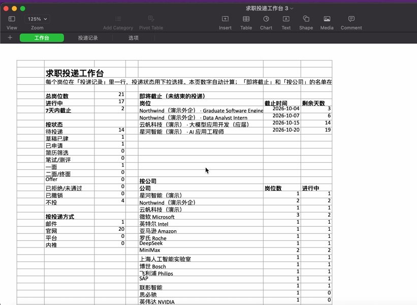
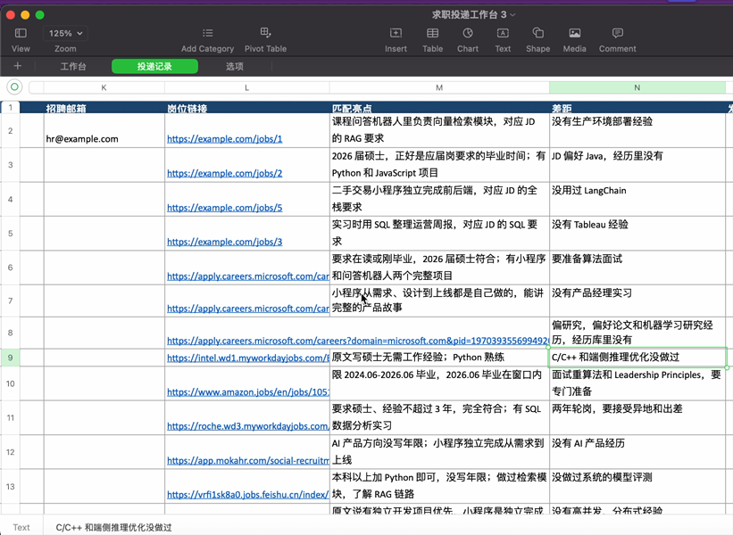

# AI 求职助手（Agent Skill）

装上这个 skill 以后，你的 AI 助手（Claude Code 或 Codex）会帮你找岗位、核实还在招、对照你的真实经历写定制求职邮件，并存进 Mail.app 草稿。**你审核过、明确说"发送"之后才会发出去。**

我自己就在用这套流程找工作：发出的第二封邮件，第二天 HR 就加我微信约了面试。

## 它做什么

```
搜索岗位 ─▶ 打开链接核实还在招 ─▶ 按届别/年限/技能筛选 ─▶ 对照你的真实经历做匹配分析
                                                              │
               ┌──────────────────────────────────────────────┤
               ▼                                              ▼
     有核实过的招聘邮箱                                  只能官网投递
   写定制邮件，附对应简历                           记进工作台，你自己去官网投
   存进 Mail.app 草稿（不发送）
               │
               ▼
        你审核，明确说"发送"
               │
               ▼
     发送前再核对收件人和附件，发送，记录
```

## 你会得到一个求职投递工作台

所有岗位都记在一个 Excel 里：首页看进度和快截止的岗位，投递记录里每个岗位写清楚公司、城市、招聘类型、投哪份简历、投递状态，以及**你哪段经历对得上、还差什么**。





（截图是演示数据）

## 三条底线

1. **不自动发送**：所有邮件停在草稿箱，你说"发送编号 1、2"这种明确的话才发。
2. **不编造经历**：只用你经历库里的真实内容，JD 要求而你没有的技能会标成差距，不硬凑。
3. **先核实再投**：每个岗位都打开链接确认在招，看清届别和年限门槛，不猜 HR 邮箱。

## 先说局限

- **能直接发邮件的岗位很少。** 大部分公司用官网招聘系统收简历，所以多数岗位最后会记进工作台，要你自己去官网投。它帮你省的是找岗位、核实、筛选、写邮件这些最耗时间的活。
- 建草稿有几种方式，配置时自动选：**macOS 的 Mail.app**（首选，用脚本直接建）；脚本跑不了但 AI 能操作电脑时（比如 Codex Computer Use），它会像人一样在 Mail 里点选填写；AI 工具已连接你的求职邮箱（比如 Gmail 连接器）时，直接在那个邮箱里建草稿；都不行时，把邮件生成为 `.eml` 文件（收件人、正文、简历附件都写好），你双击打开再发送。
- AI 也会看错、漏看，每封草稿发之前请自己读一遍。

## 安装

需要：
- 一台 Mac，Mail.app 里已添加你的求职邮箱（QQ 邮箱、163、Gmail、Outlook 等都可以加进 Mail.app）
- 能用 [Claude Code](https://claude.com/claude-code) 或 [Codex](https://openai.com/codex) 的账号
- Python 3（Mac 第一次在终端里运行 `python3` 时，如果没装，系统会提示安装开发者工具，点安装即可）。工作台还要用到 openpyxl，缺的话 AI 会先问你，再帮你装

三种装法，选一种就行：

**1. 让 AI 帮你装（最简单）**

对你的 Claude Code 或 Codex 说：

```
帮我安装这个 skill：https://github.com/Wanqing-Chenn/ai-job-hunting-agent
```

它会请求往你的 skills 文件夹里写文件，点"允许"即可。

**2. 一行命令**

在"终端"里运行：

```bash
# Claude Code
git clone https://github.com/Wanqing-Chenn/ai-job-hunting-agent.git ~/.claude/skills/ai-job-hunting-agent
```

```bash
# Codex
git clone https://github.com/Wanqing-Chenn/ai-job-hunting-agent.git ~/.codex/skills/ai-job-hunting-agent
```

**3. 下载压缩包**

在本页面点绿色的 **Code** 按钮，选 **Download ZIP**。解压后把文件夹改名为 `ai-job-hunting-agent`，放进 `~/.claude/skills/`（Claude Code）或 `~/.codex/skills/`（Codex）。这两个文件夹是隐藏的，在访达里按 Shift+Cmd+G，输入路径就能打开。

更新：用命令安装的，进到上面的文件夹运行 `git pull`；用压缩包安装的，重新下载替换。

## 第一次使用

打开 Claude Code 或 Codex，说：

```
帮我配置求职助手
```

它会一步步问你：求职邮箱、目标城市和岗位、经验情况、简历放在哪，然后帮你建好求职工作区（默认 `~/求职工作区/`），读你的简历整理出经历库（拿不准的地方会问你），最后给你自己的邮箱建一封测试草稿，确认一切正常。

想指定位置也可以直接说，比如：

```
帮我配置求职助手。工作区放在 ~/Desktop/求职工作区，我的简历在 ~/Documents/简历 里，直接读，不要复制。
```

第一次操作 Mail.app 时，macOS 会弹窗问是否允许，点"允许"。

**用 Codex 的话**：Codex 默认在沙盒里运行命令，沙盒里控制不了 Mail。它运行 Mail 脚本时如果请求在沙盒外运行，请选允许（或者在 Codex 设置里放宽权限）；如果没弹 macOS 授权窗口，去"系统设置 → 隐私与安全性 → 自动化"，打开 Codex 下面的 Mail。不想放开沙盒的话，开着 Codex Computer Use（需要"屏幕与系统录音"和"辅助功能"权限）也行，它会像人一样在 Mail 里填写草稿，只是慢一些；这两样都不想开，它会改用 .eml 文件，照样能用。

## 常用说法

| 你想做的 | 这样说 |
|---|---|
| 找一轮岗位 | 开始今天的求职任务 |
| 指定方向 | 继续找上海和苏州的外企，方向是 AI 产品经理，重点看应届能投的 |
| 平台上看到好岗位 | 这是我在 Boss 上看到的岗位：（链接或粘贴 JD），帮我看看能不能发邮件 |
| 检查草稿 | 列出草稿箱里的求职邮件，核对收件人和附件 |
| 发送 | 发送编号 1、2 |
| 准备面试 | XX 公司约我明天下午面 XX 岗位，帮我准备 |

## 关于工作台文件

`求职投递工作台.xlsx` 用 Excel、WPS、Numbers 都能打开。

- **想自己改状态，请用 Excel 或 WPS。** Numbers 打开时会转成它自己的格式，在 Numbers 里的改动不会写回这个文件，AI 也就看不到。用 Numbers 的话，只看不改，状态变了直接告诉 AI（比如"微软那个我投了"）。
- **让 AI 更新工作台之前，先在 Excel 里保存并关闭它**，不然两边会互相覆盖。忘了也没关系，AI 发现文件开着会停下来提醒你。
- 投递状态和距截止天数的颜色提醒只在 Excel 和 WPS 里显示；Numbers 里没有颜色，但统计数字照常自动计算。

## 你的数据放在哪

经历库、简历、投递记录、邮件留档都存在你自己电脑的 `~/求职工作区/` 里，不在 skill 文件夹里，更新 skill 不会覆盖它们，也不会把它们上传到 GitHub。

要知道的是：AI 读你的简历、经历库、写邮件时，这些内容会发送给你所用的 AI 服务商（Anthropic 或 OpenAI）处理，这和你平时在对话里贴简历是一样的。不想让 AI 看到的信息（证件号、密码等）不要放进工作区。

## 文件说明

```
SKILL.md                     skill 入口：触发条件、首次配置、日常流程
references/rules.md          工作规则细则
references/sources.md        去哪找岗位、常见的坑
references/profile-template.md  经历库模板
assets/config-template.md    工作区配置模板
assets/screenshots/          README 用的演示截图
scripts/workbench.py         生成和更新求职投递工作台（Excel）
scripts/make_eml.py          控制不了 Mail 时，生成可双击打开的 .eml 邮件文件
scripts/                     Mail.app 脚本：查看账号、建草稿、核对草稿箱、发送
```

## 常见问题

**我用的是 Gemini、ChatGPT 或 Claude 的网页版/App，能用吗？** 不太行。网页版和手机 App 跑在云端，碰不到你电脑上的文件和 Mail，只能把邮件贴在对话里让你复制。这个 skill 需要能在你电脑上读写文件、执行命令的 AI 工具，比如 Claude Code、Codex。

**Gemini Spark 这类连着 Gmail 的 AI 助手能用吗？** 如果你的求职邮箱是 Gmail，它们本身就能在 Gmail 里建草稿，可以让它按这个 skill 的规则做（核实岗位、不编经历、只建草稿不发送），记得确认草稿里带上了简历附件。但它们碰不到你电脑上的 Mail.app，求职邮箱不是 Gmail 的话就建不了草稿。

**用 Gemini CLI 或其他命令行 AI 工具可以吗？** 可以试试：把这个仓库下载到任意位置，对它说"读一下 <路径>/SKILL.md，按里面的流程帮我配置求职助手"。只要它能执行命令，就能用 Mail 模式；执行不了 Mail 脚本，也会自动改用 .eml 文件。

**Windows 能用吗？** 能。找岗位、工作台都一样；邮件会生成为 `.eml` 文件，Outlook 双击打开就是草稿，检查后点发送即可。

**"屏幕与系统录音"权限我开过了，为什么还连不上 Mail？** 那是给"操作电脑"（看屏幕、点鼠标）用的，比如 Codex Computer Use。这个 skill 优先用脚本直接控制 Mail，走的是另一个权限"自动化"。两种都能建草稿，脚本更快、更不容易出错。

**AI 说连不上 Mail 怎么办？** 按顺序检查三件事：Mail.app 里加了求职邮箱；"系统设置 → 隐私与安全性 → 自动化"里允许了你的 AI 工具控制 Mail；用 Codex 的话，允许它在沙盒外运行这条命令。都弄好后让它再试一次。还不行，它会改用 .eml 文件，不影响使用。

**它会帮我在招聘网站或官网上自动投递吗？** 不会。它不碰招聘平台，也不替你提交官网申请表；官网岗位记进工作台，你自己去投。

**为什么它说找到的岗位不多？** 有公开 HR 邮箱、又不卡年限的岗位本来就少，它不会为了凑数放进已关闭或不合适的岗位。

**怎么卸载？** 删掉 `~/.claude/skills/ai-job-hunting-agent`（或 `~/.codex/skills/ai-job-hunting-agent`）这个文件夹即可。你的 `~/求职工作区/` 不会受影响，不需要的话自己删除。

## 免责声明

岗位信息来自公开网页，可能有过时或不准确的地方；招聘邮箱以公司官方公布为准。投递前请自己再确认一遍岗位要求和邮件内容。这个工具不保证面试或录用结果。

## 请善意使用

这套流程的前提是人审核每一封邮件。请不要把它改成自动群发：这会打扰 HR，也容易让你的邮箱被当成垃圾邮件。招聘平台请遵守平台规则自己操作。

## License

MIT
